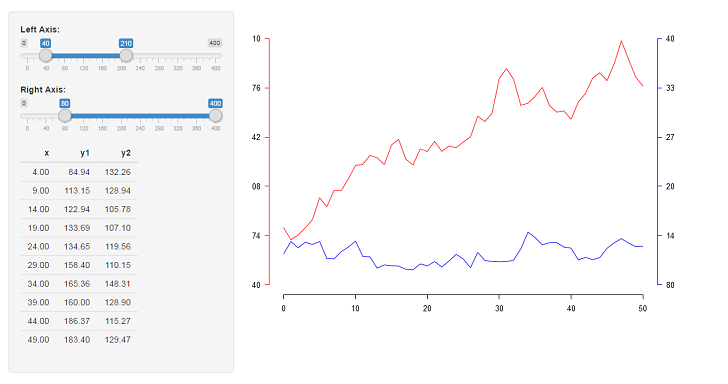
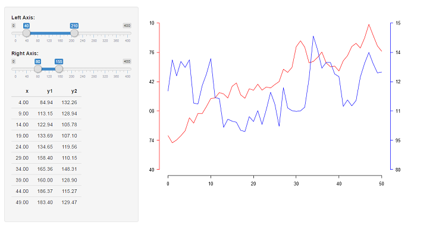
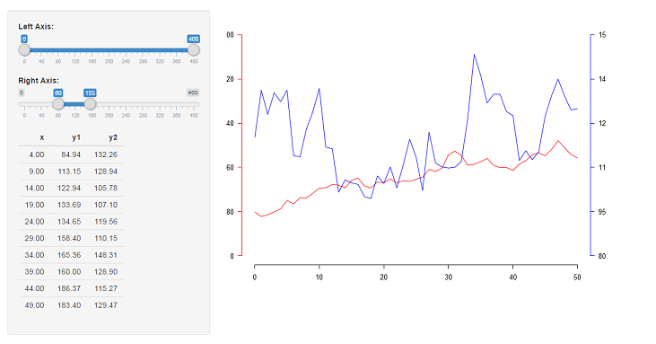
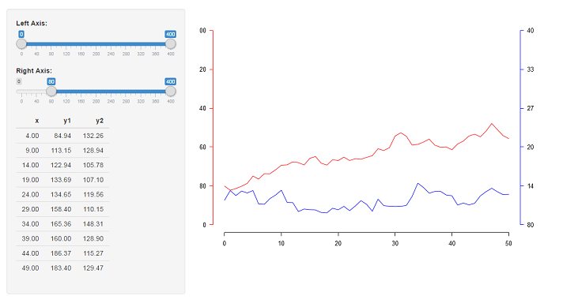

# Dual y-axis figures are usually terrible

This is a simple Shiny app to show why dual y-axis figures are usually terrible.*

To run it, do:

```R
library("shiny")
runGitHub("dual-axis", "leeper")
```

As some quick examples, here are four screenshots showing how to manipulate two time series to appear to have basically any relationship:









As a result, the visualization - on premise - fails the most important criterion of data presentation: truthfulness.

---

* The only exception is when the two axes are linear transformations of each other (e.g., Fahrenheit to Celsius temperature conversions).
